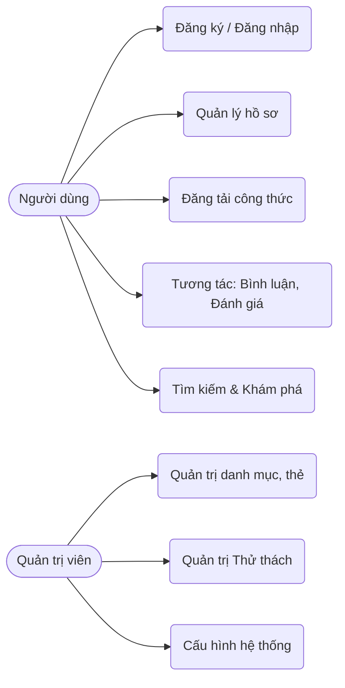
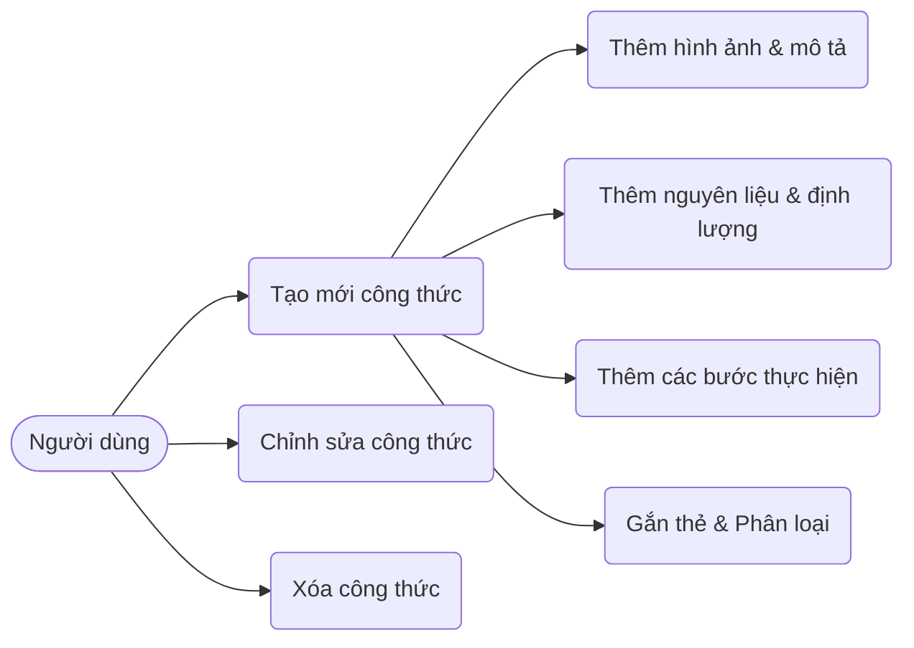
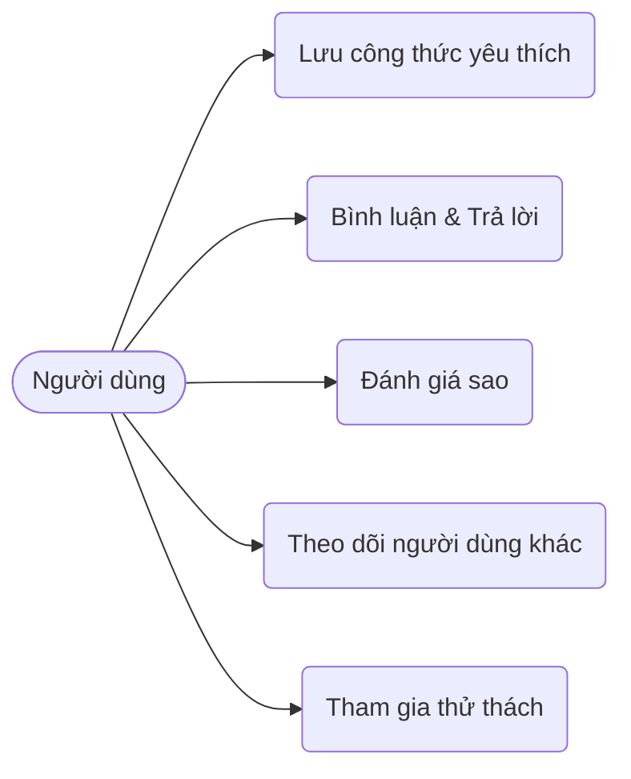
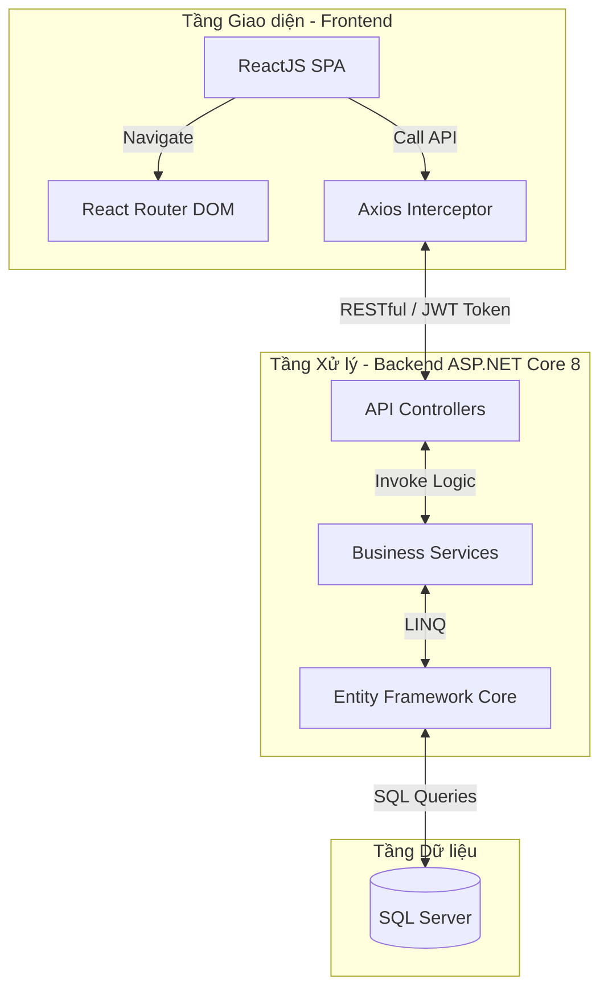

**NHẬN XÉT CỦA GIẢNG VIÊN HƯỚNG DẪN**

_…………, ngày ….. tháng …… năm ……_

**Giáo viên hướng dẫn**

_(Ký tên và ghi rõ họ tên)_

_Trà Vinh, ngày ….. tháng …… năm ……_

**Giáo viên hướng dẫn**

_(Ký tên và ghi rõ họ tên)_

**LỜI CẢM ƠN**

**NHẬN XÉT CỦA THÀNH VIÊN HỘI ĐỒNG**

_……….., ngày ….. tháng …… năm ……_

**Thành viên hội đồng**

_(Ký tên và ghi rõ họ tên)_

Em xin gửi lời cảm ơn chân thành và sâu sắc đến thầy **Đoàn Phước Miền**, giảng viên phụ trách môn **Lập trình .NET**, đã tận tình giảng dạy, truyền đạt những kiến thức quý báu và luôn hỗ trợ em trong suốt quá trình học tập và thực hiện đồ án/bài báo cáo này.

Nhờ sự hướng dẫn tận tâm của thầy, em đã có cơ hội tiếp cận và nâng cao kiến thức về nền tảng .NET, đồng thời rèn luyện được kỹ năng phân tích, thiết kế và xây dựng ứng dụng thực tế. Những góp ý và chỉ dẫn của thầy đã giúp em hoàn thiện bài thực hiện một cách tốt hơn và có thêm nhiều kinh nghiệm quý báu cho quá trình học tập cũng như công việc sau này.

Mặc dù đã cố gắng hoàn thành bài báo cáo với tất cả khả năng của mình, nhưng do kiến thức và kinh nghiệm còn hạn chế nên khó tránh khỏi những thiếu sót. Em rất mong nhận được sự góp ý và nhận xét từ thầy để có thể hoàn thiện hơn trong tương lai.

Một lần nữa, em xin chân thành cảm ơn thầy Đoàn Phước Miền đã luôn tận tâm giảng dạy và hỗ trợ em trong suốt thời gian qua.

**Sinh viên thực hiện**

**Võ Tuyến Phát**

**Email**: vphat772@gmail.com

**MỤC LỤC**

[CHƯƠNG 1: TỔNG QUAN](#chuong-1-tong-quan)
[1.1 Lý do chọn đề tài](#ly-do-chon-de-tai)
[1.2 Mục tiêu nghiên cứu](#muc-tieu-nghien-cuu)
[1.3 Đối tượng nghiên cứu](#doi-tuong-nghien-cuu)
[1.4 Phạm vi nghiên cứu](#pham-vi-nghien-cuu)
[CHƯƠNG 2: NGHIÊN CỨU LÝ THUYẾT](#chuong-2-nghien-cuu-ly-thuyet)
[2.1 Cơ sở lý thuyết công nghệ](#co-so-ly-thuyet-cong-nghe)
[CHƯƠNG 3: HIỆN THỰC HÓA NGHIÊN CỨU](#chuong-3-hien-thuc-hoa-nghien-cuu)
[3.1 Mô tả bài toán](#mo-ta-bai-toan)
[3.2 Yêu cầu chức năng](#yeu-cau-chuc-nang)
[3.3 Mô hình cơ sở dữ liệu](#mo-hinh-co-so-du-lieu)
[3.4 Lược đồ Use case](#luoc-do-use-case)
[3.5 Kiến trúc hệ thống](#kien-truc-he-thong)
[CHƯƠNG 4: KẾT QUẢ NGHIÊN CỨU](#chuong-4-ket-qua-nghien-cuu)
[CHƯƠNG 5: KẾT LUẬN VÀ HƯỚNG PHÁT TRIỂN](#chuong-5-ket-luan-va-huong-phat-trien)
[DANH MỤC TÀI LIỆU THAM KHẢO](#danh-muc-tai-lieu-tham-khao)

**TÓM TẮT ĐỒ ÁN**

Đồ án tập trung nghiên cứu và xây dựng nền tảng chia sẻ công thức nấu ăn trực tuyến (dạng mạng xã hội ẩm thực tương tự Cookpad) nhằm kết nối những người đam mê ẩm thực trong thời đại số. Hệ thống hiện thực hóa các chức năng tương tác đồng bộ: người dùng có thể tạo trang cá nhân, đăng tải công thức nấu ăn với đầy đủ thành phần nguyên liệu và các bước thực hiện, gắn thẻ (tags) phân loại, bình luận, đánh giá và lưu trữ công thức yêu thích. Đồng thời, nền tảng cung cấp các tính năng mạng xã hội như theo dõi người dùng khác và hệ thống xếp hạng, xu hướng nổi bật, cũng như các thử thách (challenges) nấu ăn định kỳ. Quản trị viên có khả năng quản lý danh mục, thẻ, cấu hình hệ thống và các chiến dịch tài trợ (Sponsored Campaigns). Toàn bộ giải pháp được xây dựng trên nền tảng .NET 8 (Backend) và ReactJS (Frontend) hiện đại, mang lại trải nghiệm mượt mà, tối ưu hóa quá trình chia sẻ và khám phá ẩm thực.

**MỞ ĐẦU**

Trong cuộc sống hiện đại bận rộn, việc tự nấu ăn tại nhà không chỉ giúp đảm bảo sức khỏe, tiết kiệm chi phí mà còn là một thú vui giải tỏa căng thẳng. Cùng với sự phát triển mạnh mẽ của công nghệ thông tin và Internet, nhu cầu chia sẻ và học hỏi các công thức nấu ăn đã chuyển dịch sang môi trường trực tuyến. Sự thay đổi này không chỉ giúp tiết kiệm thời gian tra cứu sách báo truyền thống mà còn kết nối cộng đồng những người có chung đam mê ẩm thực trên phạm vi toàn cầu.

Tuy nhiên, thông tin công thức nấu ăn hiện nay vẫn còn phân tán trên nhiều nền tảng mạng xã hội khác nhau, thiếu tính tổ chức và phân loại rõ ràng, gây khó khăn cho người dùng trong việc tìm kiếm công thức theo nguyên liệu có sẵn, theo chế độ dinh dưỡng hoặc theo sự kiện đặc biệt.

Xuất phát từ thực tiễn đó, đề tài "Xây dựng nền tảng chia sẻ công thức nấu ăn trực tuyến" được lựa chọn nhằm nghiên cứu và phát triển một hệ thống mạng xã hội ẩm thực tập trung, tối ưu trải nghiệm người dùng trong việc tìm kiếm, lưu trữ và chia sẻ đam mê nấu nướng.

# CHƯƠNG 1: TỔNG QUAN

## 1.1 Lý do chọn đề tài

Hiện nay, khi có nhu cầu học nấu một món ăn mới, phần lớn người dùng đều tìm kiếm trên Internet. Việc xây dựng một nền tảng chuyên biệt như mạng xã hội ẩm thực (tương tự mô hình Cookpad) giúp tập trung nguồn dữ liệu khổng lồ do chính người dùng đóng góp (User-Generated Content). Điều này hỗ trợ người dùng dễ dàng tìm kiếm công thức theo nguyên liệu, thể loại hoặc từ khóa, đồng thời tạo ra một cộng đồng để giao lưu, học hỏi và tương tác thông qua tính năng bình luận, đánh giá và theo dõi lẫn nhau. Từ những lý do trên, việc phát triển ứng dụng chia sẻ công thức nấu ăn là thiết thực và có tính ứng dụng cao.

## 1.2 Mục tiêu nghiên cứu

- Tìm hiểu quy trình và nghiệp vụ của một mạng xã hội chia sẻ công thức nấu ăn.
- Tìm hiểu và xây dựng nền tảng ứng dụng web bằng công nghệ ASP.NET Core và ReactJS.
- Phương pháp nghiên cứu:
  - Lý thuyết: tìm hiểu về ASP.NET Core Web API, ReactJS, Vite, hệ quản trị cơ sở dữ liệu SQL Server và Entity Framework Core.
  - Thực nghiệm: xây dựng một website hoàn chỉnh nhằm đánh giá tính đúng đắn và hiệu năng của hệ thống.

## 1.3 Đối tượng nghiên cứu

- Về công nghệ: ASP.NET Core 8 Web API, ReactJS, SQL Server, RESTful API.
- Về nghiệp vụ: Tham khảo các tính năng của các nền tảng ẩm thực hàng đầu như Cookpad.

## 1.4 Phạm vi nghiên cứu

Thiết kế và cài đặt hệ thống tập trung vào 2 phân hệ người dùng chính: Người dùng thông thường (User/Creator) và Quản trị viên (Admin).

# CHƯƠNG 2: NGHIÊN CỨU LÝ THUYẾT

## 2.1 Cơ sở lý thuyết công nghệ

### 2.1.1 Kiến trúc phân tách Client - Server

Để xây dựng được dự án ta áp dụng kiến trúc tách rời hoàn toàn giữa tầng giao diện (Frontend) và tầng xử lý nghiệp vụ (Backend):
- Tầng giao diện (ReactJS): Hiển thị giao diện người dùng và xử lý tương tác.
- Tầng xử lý nghiệp vụ (ASP.NET Core Web API): Chạy trên máy chủ, nhận yêu cầu, thực thi nghiệp vụ và tương tác với CSDL. RESTful API được thiết kế theo tiêu chuẩn Stateless.

### 2.1.2 Công nghệ phía Server (Backend)

- **ASP.NET Core 8 Web API**: Khung làm việc mã nguồn mở, đa nền tảng mang lại hiệu năng cao.
- **Clean Architecture**: Tổ chức mã nguồn thành các lớp Domain, Application, Infrastructure và API, giúp dễ bảo trì và mở rộng.
- **Entity Framework Core (EF Core)**: Trình ánh xạ quan hệ thực thể giúp thao tác với SQL Server thông qua LINQ.
- **Identity & Security**: Sử dụng ASP.NET Core Identity quản lý User và JWT để bảo mật các API endpoints.

### 2.1.3 Công nghệ phía Client (Frontend)

- **ReactJS**: Thư viện Javascript xây dựng giao diện UI dạng Single Page Application.
- **Vite**: Công cụ build siêu tốc cho môi trường React.
- **Axios**: Thư viện gọi API mạnh mẽ, tích hợp Interceptor gửi JWT tự động.

### 2.1.4 Hệ quản trị Cơ sở dữ liệu

- **Microsoft SQL Server**: Lưu trữ thông tin thành viên, dữ liệu công thức phức tạp có quan hệ với nguyên liệu, bước thực hiện, thẻ tag.

# CHƯƠNG 3: HIỆN THỰC HÓA NGHIÊN CỨU

## 3.1 Mô tả bài toán

Xây dựng hệ thống cho phép người dùng chia sẻ công thức cá nhân, tương tác với các công thức của người khác. Quản trị viên cần công cụ quản lý nội dung, danh mục, kiểm duyệt và quản trị các thử thách cộng đồng (Challenges) và tài trợ (Sponsorships).

## 3.2 Yêu cầu chức năng

- **Người dùng (User)**:
  - **Đăng ký/Đăng nhập**: Quản lý tài khoản (Auth).
  - **Hồ sơ cá nhân**: Chỉnh sửa thông tin, xem các công thức đã đăng. Public Profile cho người khác xem.
  - **Quản lý công thức (Recipe)**: Form đăng bài chi tiết bao gồm tiêu đề, hình ảnh, thời gian nấu, khẩu phần, danh sách nguyên liệu (Ingredients), các bước thực hiện (Instruction Steps), và gắn thẻ (Tags). Cập nhật/Xóa công thức của mình.
  - **Khám phá & Tìm kiếm**: Tìm kiếm công thức theo tên, thẻ hoặc nguyên liệu. Xem xu hướng, bảng xếp hạng.
  - **Tương tác**: Bình luận (Comment), đánh giá sao (Rate), lưu công thức yêu thích (Favorite), theo dõi tác giả (Follow).
  - **Tham gia thử thách**: Xem và tham gia các Challenges ẩm thực do hệ thống tổ chức.

- **Quản trị viên (Admin)**:
  - **Quản trị dữ liệu lõi**: Thêm, sửa, xóa danh mục món ăn (Categories), thẻ (Tags).
  - **Quản lý Thử thách & Tài trợ**: Thiết lập thông số cho Challenges, quản lý Sponsored Campaigns (nhà tài trợ xuất hiện trên trang chủ).
  - **Cấu hình hệ thống**: Thay đổi SystemConfigs.

## 3.3 Mô hình cơ sở dữ liệu

Hệ thống được thiết kế dựa trên các thực thể chính sau:

#### Bảng Users (Tài khoản người dùng)
| Tên cột | Kiểu dữ liệu | Ghi chú |
| --- | --- | --- |
| Id | Nvarchar | Khóa chính (IdentityUser) |
| Email | Nvarchar | Email đăng nhập |
| UserName | Nvarchar | Tên hiển thị độc nhất |
| PasswordHash | Nvarchar | Mật khẩu mã hóa |

#### Bảng Recipes (Công thức nấu ăn)
| Tên cột | Kiểu dữ liệu | Ghi chú |
| --- | --- | --- |
| Id | Int | Khóa chính |
| Title | Nvarchar | Tên công thức |
| Slug | Nvarchar | Đường dẫn thân thiện (Unique) |
| AuthorId | Nvarchar | Khóa ngoại User |
| CategoryId | Int | Khóa ngoại Category |
| CreatedAt | Datetime | Ngày đăng |

#### Bảng Ingredients (Nguyên liệu gốc)
| Tên cột | Kiểu dữ liệu | Ghi chú |
| --- | --- | --- |
| Id | Int | Khóa chính |
| Name | Nvarchar | Tên nguyên liệu (Unique) |

#### Bảng RecipeIngredients (Thành phần của công thức)
| Tên cột | Kiểu dữ liệu | Ghi chú |
| --- | --- | --- |
| RecipeId | Int | Khóa ngoại Recipe |
| IngredientId | Int | Khóa ngoại Ingredient |
| Quantity | Nvarchar | Định lượng (ví dụ: 200g, 1 muỗng) |

#### Bảng InstructionSteps (Các bước thực hiện)
| Tên cột | Kiểu dữ liệu | Ghi chú |
| --- | --- | --- |
| Id | Int | Khóa chính |
| RecipeId | Int | Khóa ngoại |
| StepNumber | Int | Thứ tự bước |
| Description | Nvarchar | Nội dung thực hiện |

#### Bảng Comments & Ratings (Tương tác)
- **Comments**: Lưu bình luận người dùng, có ParentCommentId để trả lời (Reply).
- **Ratings**: Lưu số sao người dùng đánh giá cho một Recipe.
- **Favorites**: Bảng trung gian User - Recipe để lưu danh sách yêu thích.
- **UserFollows**: Bảng theo dõi lẫn nhau giữa các Users.

#### Bảng Tags & Thử thách (Challenges)
- **Tags**: Phân loại theo chủ đề.
- **RecipeTags**: Liên kết công thức và thẻ.
- **Challenges**: Cuộc thi/Thử thách nấu ăn, gắn liền với một TagName để lọc bài dự thi.

## 3.4 Lược đồ Use case

### 3.4.1 Lược đồ Use case tổng quát
Sơ đồ dưới đây mô tả các tác nhân (Actors) và các ca sử dụng (Use cases) chính trong hệ thống.

### 3.4.2 Lược đồ Use case đăng tải công thức
Chi tiết các hành động khi người dùng tạo hoặc quản lý công thức của họ.

### 3.4.3 Lược đồ Use case tương tác cộng đồng
Các tính năng mạng xã hội giữa người dùng và công thức.

## 3.5 Kiến trúc hệ thống

Trang web sử dụng mô hình REST API. Frontend ReactJS gọi API tới Backend ASP.NET Core. Kiến trúc tổng thể được thể hiện qua sơ đồ sau:

### Công nghệ sử dụng trong Hệ thống
- **Frontend**: ReactJS, Vite, Axios, React Router DOM, React Hook Form, Framer Motion.
- **Backend**: ASP.NET Core 8.0, Entity Framework Core 8, Microsoft.AspNetCore.Identity.EntityFrameworkCore.
- **Cơ sở dữ liệu**: SQL Server.

# CHƯƠNG 4: KẾT QUẢ NGHIÊN CỨU

Đã xây dựng thành công bộ khung cơ sở dữ liệu và các API thiết yếu (Recipe, Category, Tag, Comment, Challenge, Profile). Giao diện ứng dụng cơ bản đã có luồng đăng nhập, trang chủ hiển thị bảng xếp hạng, và trang chi tiết tạo/sửa công thức.

# CHƯƠNG 5: KẾT LUẬN VÀ HƯỚNG PHÁT TRIỂN

## 5.1 Kết luận
### 5.1.1 Kết quả đạt được
Hoàn thiện kiến trúc phần mềm, phát triển giao diện hiện đại với ReactJS. Tích hợp các tính năng mạng xã hội như bình luận, theo dõi, thử thách, giúp tăng cường tương tác cộng đồng. Hệ thống API Backend được xây dựng tuân thủ Clean Architecture, đảm bảo hiệu suất và dễ mở rộng.

### 5.1.2 Những đóng góp mới của đề tài
Hệ thống cho phép lưu trữ nguyên liệu tách rời (Ingredients) kết hợp định lượng (RecipeIngredients) giúp tìm kiếm chính xác, thay vì chỉ lưu văn bản thô. Tích hợp hệ thống Thử thách (Challenges) và Nhà tài trợ (Sponsorship) giúp ứng dụng có tiềm năng duy trì cộng đồng và doanh thu.

## 5.2 Hướng phát triển
- Gợi ý công thức bằng AI dựa trên nguyên liệu người dùng đang có sẵn tủ lạnh.
- Tính toán thành phần dinh dưỡng (Calories, Macro) tự động từ định lượng nguyên liệu.
- Ra mắt ứng dụng di động đa nền tảng (React Native) để tiện lợi hơn khi sử dụng trong bếp.

# DANH MỤC TÀI LIỆU THAM KHẢO

| \[1\] | Microsoft, "Build web apps with ASP.NET Core for beginners". |
| ----- | ------------------------------------------------------------ |
| \[2\] | HoleTex, "Học React JS cơ bản trong 30 phút", Youtube.       |
| \[3\] | Cookpad Community Features & UI/UX References.               |